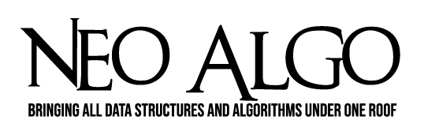

     
    
    
    
    
    

# Codes in the C++ language

## Competitive Programming

- [2-D Matrix Sorting](cp/2-D_MatrixSorting.cpp)
- [ActivitySelection](cp/Activity_Selection.cpp)
- [ArraySub](cp/ARRAYSUB.cpp)
- [Array Right Rotation Naive Approach](cp/Array_Right_Rotate.cpp)
- [All Possible Sum Using FFT](cp/all_possible_sums_using_fft.cpp)
- [Check Anagrams](cp/check_anagrams.cpp)
- [Check for Subsequence](cp/Check_for_Subsequence.cpp)
- [Container with most water](cp/Container_with_most_water.cpp)
- [Contiguous Sub Array with Given Sum](cp/SubArrayWithGivenSum.cpp)
- [Count of string P in string S](cp/CountofPinS.cpp)
- [Elements Occurrence using Binary Search](cp/ElementsOccurrence_BinarySearch.cpp)
- [Factorial of Very Large Numbers](cp/Factorial_of_very_large_numbers.cpp)
- [Find number of digits in an integer](cp/find_no_of_digits_in_int.cpp)
- [Find leftmost non repeating character in string](cp/Leftmostnonrepeatingchar.cpp)
- [Infix to Postfix](cp/infix_to_postfix.cpp)
- [Intersection of Y-shaped linked list](cp/Intersection_Point_of_Y_shaped_LinkedList.cpp)
- [Josephus Problem](cp/Josephus.cpp)
- [Kadane's Algorithm for max sum subArray](cp/Kadane_Alogorithm.cpp)
- [Knuth–Morris–Pratt algorithm](cp/Knuth_Morris_Pratt.cpp)
- [Longest Common Prefix](cp/longestCommonPrefix.cpp)
- [Longest Subarray with Zero Sum](cp/ZeroSum.cpp)
- [Maximum in Array](cp/Maximum_In_Array.cpp)
- [Minimum Spanning Tree](cp/minimum_spanning_tree.cpp)
- [Mos Algorithm](cp/MosAlgo.cpp)
- [Next Largest Permutation](cp/NextPermutation.cpp)
- [NQueens](cp/NQueens.cpp)
- [Painter Partition](cp/painter_partition.cpp)
- [Print All Subsequences using Recursion](cp/PrintAllSubsequences.cpp)
- [Rain Water Harvesting](cp/Rainwaterharvesting.cpp)
- [Rat In A Maze](cp/ratInAMaze.cpp)
- [Reverse words in Given String](cp/Reverse_Words_in_String.cpp)
- [Search Insert Position](cp/search_insert_position.cpp)
- [Spiral Matrix](cp/Spiral_Matrix.cpp)
- [String to Integer](cp/String_to_int.cpp)
- [Sub-array with given sum](cp/SubArrayWithGivenSum.cpp)
- [Suduko Solver](cp/SudukoSolver.cpp)
- [Target Sum triplets](cp/target_sum_triplets.cpp)
- [Z Algorithm](cp/zalgorithm.cpp)

## Data Structures

- [Add Post-Order Tree Traversal](ds/postorder.cpp)
- [Binary Search Tree](ds/BinarySearchTree.cpp)
- [Binary Tree Preorder Traversal](ds/BinaryTree_PreorderTraversal.cpp)
- [Binary Tree](ds/BinaryTree.cpp)
- [Circular Linkedlist](ds/Circular_LinkedList.cpp)
- [Doubly Linked List](ds/DoublyLinkedList.cpp)
- [Hashtable with separate chaining](ds/Hashing_with_chaining.cpp)
- [Heap Sort](ds/heap_sort.cpp)
- [Middle Element of a Linked List](ds/linked_list_middle_element.cpp)
- [Linked List](ds/LinkedList.cpp)
- [Max and Min heap Implementation](ds/max_min_heap.cpp)
- [Nodes At A Distance K From A Given Target Node In A Binary Tree](ds\K_Distance_Nodes_Binary_Tree.cpp)
- [Priority Queue](ds/Priority_Queue.cpp)
- [Queue](ds/queue.cpp)
- [Queue Linked List](ds/QueueLinkedList.cpp)
- [Red Black Tree](ds/RED-BLACK-TREE.cpp)
- [Reverse Linked List](ds/Reverse_linked_list.cpp)
- [Singly Linked List](../Python/ds/SinglyLinkedList.py)
- [Singly Linked List](ds/singly_linked_list.cpp)
- [Stack using Array](ds/Stack_using_Array.cpp)
- [Stack using Linked List](ds/Stack_using_LinkedList.cpp)
- [Tim Sort](ds/Tim_Sort.cpp)
- [Trie Implementation](ds/Trie_implementation.cpp)
- [Vector](ds/Vector.cpp)
- [Ancestors in Binary Search Tree](ds/ancestors_of_given_number_BST.cpp)
- [Binary Search Tree to Greater Sum Tree](ds/BST_to_Greater_Sum_Tree.cpp)
- [Threaded Binary Tree](ds/ThreadedBinaryTree.cpp)

## Graphs

- [Articulation points in an Undirected Graph](graphs/Articulation_points.cpp)
- [Bellman Ford's Algorithm](graphs/BellmanFord.cpp)
- [Breadth First Search Tree Traversal](graphs/bfs.cpp)
- [Bridges in an Undirected Graph](graphs/Bridges.cpp)
- [Check for bipartite graph](graphs/Check_for_bipartite_graph.cpp)
- [Cycle Detection in a Directed Graph](graphs/DirectedCycleDetection.cpp)
- [Cycle Detection in Graph](graphs/detect_cycle.cpp)
- [Depth First Search Algorithm](graphs/DFS.cpp)
- [Depth Of Tree](graphs/Depth_of_tree.cpp)
- [Detect Negative Cycle in Graph](graphs/DetectNegativeCycle.cpp)
- [Dijkstra's Algorithm](graphs/Dijkstra_algorithm.cpp)
- [Edmond Karp's Algorithm](graphs/EdmondKarp.cpp)
- [Flood fill](graphs/FloodFill.cpp)
- [Floyd Warshall ALgorithm (ASSP)](graphs/FloydWarshallAlgorithm.cpp)
- [In-order (LNR) Tree Traversal](graphs/inorder-traversal.cpp)
- [Kosaraju Algorithm](graphs/Kosaraju_Algorithm.cpp)
- [Kruskal's Algorithm](graphs/kruskal_Algorithm.cpp)
- [Post-order (LRN) Tree Traversal](graphs/Postorder_Traversal.cpp)
- [Pre-order (NLR) Tree Traversal](/graphs/Preorder_Traversal.cpp)
- [Prim's Algorithm](graphs/Prim_Algorithm.cpp)
- [Toplogical Sort in Diredted Acyclic Graph (DAG)](graphs/TopologicalSort.cpp)
- [Tarjan's Algorithm](graphs/Tarjan's_Algorithm.cpp)
- [Vertical Order print of Binary Tree](graphs/Vertical_order_print_of_binary_tree.cpp)
- [Left view of Tree](graphs/left_view_of_tree.cpp)
- [Right view of Tree](graphs/right_view_of_tree.cpp)
- [Breadth First Search](graphs/BFS1.cpp)
- [ZigZag traversal of Tree](graphs/zigzag_tree_traversal.cpp)

## Searching

- [Binary Search](search/Binary_Search.cpp)
- [Bilinear Search](search/bilinear_search.cpp)
- [Exponential Search](search/exponential_search.cpp)
- [Interpolation Search](search/Interpolation_Search.cpp)
- [Jump Search](search/Jump_Search.cpp)
- [Linear Search](search/Linear_Search.cpp)
- [Manacher's Algorithm](search/Manacher's_Algorithm.cp)
- [Randomized Select Search](search/Randomized_Select.cpp)
- [Staircase Search](search/Staircase_Search.cpp)
- [Tenary Search](search/TernarySearch.cpp)
- [Fibonacci Search](search/fibonacci_search.cpp)

## Sorting

- [Bead Sort](sort/Bead_Sort.cpp)
- [Bubble Sort](sort/Bubble_Sort.cpp)
- [Bucket Sort](sort/bucket_sort.cpp)
- [Cocktail shaker sort](sort/Cocktail_shaker_sort.cpp)
- [Count Sort](sort/countsort.cpp)
- [Counting Sort](sort/counting_sort.cpp)
- [Heap Sort](sort/HeapSort.cpp)
- [Insertion Sort](sort/insertion.cpp)
- [Merge Sort](sort/Merge_Sort.cpp)
- [Quick Sort](sort/Quick_Sort.cpp)
- [Radix Sort](sort/radix_sort.cpp)
- [Randomized Quick Sort](sort/Randomized_Quick_Sort.cpp)
- [Selection Sort](sort/selection_sort.cpp)
- [Shell Sort](sort/ShellSort.cpp)
- [Topological Sort](sort/Topological_Sorting_DFS.cpp)
- [Sleep Sort](sort/sleep_sort.cpp)

## Stack based problems

-[Infix to Postfix Conversiion](stack/Infix_to_Postfix.c)
- [Check for balanced parenthesis](stack/Check_for_balanced_parenthesis.cpp)
- [Evaluation of Postfix Expression](stack/evaluate_postfix.cpp)
- [Largest rectangular area under histogram](stack/Largest_rect_area_under_histogram.cpp)
- [Stock Span Problem](stack/Stock_span_problem.cpp)
- [Evaluate string expression BODMAS](stack/string_expression_evaluation_bodmas.cpp)

## Heap based problems

- [Median in a running stream of integers](heap/Median_in_a_running_stream_of_integers.cpp)
- [Merge K sorted arrays](heap/Merge_k_sorted_arrays.cpp)

## Machine Learning

_add list here_

## Mathematics

- [Ackermann Function](math/Ackermann_function.cpp)
- [Armstrong Number](math/armstrong_number.cpp)
- [Binary Exponentiation](math/Binary_Exponentiation.cpp)
- [Catalan number](math/catalan_num.cpp)
- [Double factorial](math/double_factorial.cpp)
- [Euler's_Totient_Function](math/Euler's_Totient_function.cpp)
- [Extended Euclidean Algorithm](math/Extended_Euclidean_Algorithm.cpp)
- [Palindrome Number](math/check_palindrome.cpp)
- [Pythagorean Triples Generator](math/Pythagorean_Triples.cpp)
- [Sieve of Eratosthenes](math/Sieve_of_Eratosthenes.cpp)
- [Ugly Numbers](math/ugly_numbers.cpp)

## Dynamic Programming

- [Coin Change Problem](dp/Coin_Change_Problem.cpp)
- [Edit distance](dp/edit_distance.cpp)
- [Egg Dropping Problem](dp/Egg_Dropping.cpp)
- [Fibonacci bottom to top](dp/fibonacci_bottom_up.cpp)
- [Fibonacci top to bottom](dp./../dp/fibonacci_top_down.cpp)
- [Implement Floyd-Warshall Algorithm](dp/floyd_warshall.cpp)
- [Longest common sub sequence](dp/longest_increasing_subsequence.cpp)
- [Longest increasing subsequence](dp/longest_increasing_subsequence.cpp)
- [Matrix Chain Multiplication](dp/Matrix_Chain_Multiplication.cpp)
- [Maximum Subarray Sum (Constant Space)](dp/Max_subarray_sum_constant_space(DP).cpp)
- [[Maximum Subarray Sum (Constant Space)](dp/Max_subarray_sum_constant_space(DP).cpp)]
- [Maximum Sum Rectangle](dp/max_sum_rectangle.cpp)
- [Maximum Square Matrix With All 1s](dp/maxSquareMatrixWithOnes.cpp)
- [Minimum Sum Partition](dp/Minimum_Sum_Partition.cpp)
- [Number Of Binary Trees](dp/number_of_binary_trees.cpp)
- [Partition Problem](dp/Partition_Problem.cpp)
- [Rectangle Cutting Problem](dp/Rectangle_cutting.cpp)
- [String permutations](dp/string_permutations.cpp)
- [Wild Card Pattern Matching](dp/WildCardMatching.cpp)
- [Unique BST](dp/Unique_BST.cpp)
- [Zero One Knapsack](dp/Zero_One_Knapsack.cpp)
- [ZeroN Knapsack](dp/Zero_N_knapsack.cpp)
- [Sprague Grundy Theorem on Strings](dp/Sprague_Grundy_Theorem.cpp)

## Blockchain

_add list here_

## Cryptography

- [Affine substitution Cipher](cryptography/Affine_substitution_Cipher.cpp)
- [Rail Fence Transposition Technique](cryptography/Rail_fence_Cipher.cpp)
- [Simple Columnar Transposition Technique](cryptography/Simple_Columnar_Transposition.cpp)
- [Simple Columnar with Multiple Rounds Transposition Technique](cryptography/Simple_Columnar_Transposition_multiple_rounds.cpp)
- [Vigenere Cipher](cryptography/Vigenere_Cipher.cpp)
- [Vernam Cipher](cryptography/VernamCipher.cpp)

## Computational Geometry

- [Convex Hull (Jarvis' Algorithm)](computational_geometry/Convex_Hull_Jarvis_Algorithm.cpp)

## Other

- [Boyer–Moore majority vote algorithm](other/majority_vote_algorithm.cpp)
- [Count of distinct elements in a window](cp/DistinctElementsinaWindow.cpp)
- [Fast Fibonacci Last digit](other/Fast_fibonacci_last_digit.cpp)
- [Find the Numbers](other/find_the_numbers.cpp)
- [First Missing Positive Number](other/First_Missing_Positive_Number.cpp)
- [Generate all Subsets](other/subsets.cpp)
- [Kth largest element](other/Kth_largest_element.cpp.cpp)
- [Least Common Multiple](other/lcm.cpp)
- [Merging two sorted arrays without extra space](other/merge_2_sorted_arrays_without_extra_space.cpp)
- [Print all codes of a string using recursion](cp/printallcodes_recursion.cpp)
- [Rabin Karp Algorithm (using rolling hash)](other/Rabin_Karp_Algorithm_using_rolling_hash.cpp)
- [Rabin Karp Algorithm (using prefix sum)](other/Rabin_Karp_Algorithm_using_prefix_sum.cpp)
- [Remove Outermost Parantheses](other/remove_outermost_parenthesis.cpp)
- [Russian Peasant Algorithm](other/RussianPeasantAlgo.cpp)
- [String Rotation based on Queries](other/string_rotation.cpp)
- [Sudoku Solver](other/sudoku.cpp)
- [Swap Two Nibbles](other/SwapTwoNibbles.cpp)
- [Unique_Number_III](other/Unique_Number_III.cpp)
- [KnapSack Fractional using Greedy Approach](other/knapsackfraction.cpp)
- [Prime Sieve Algorithm](other/Prime_Sieve.cpp)
