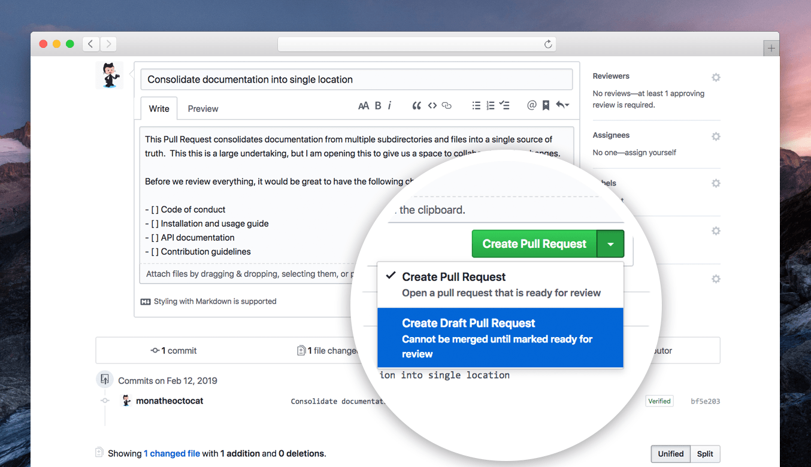

# Contributing Guidelines
### Learn how to create issues, Fork a repo, makes changes, and ask the maintainers to review and merge it
## Creating Pull Request
You have a GitHub repo and can push to it. All is well. But how the heck do you contribute to other people's GitHub projects? That is what I wanted to know after I learned git and GitHub. I will explain how to fork a git repo, make changes, and submit a pull request.

 - When you want to work on another's GitHub project, the first step is to fork a repo.
  
 
 - Once there click on the Fork button in the top-right corner. This creates a new copy of the repo under your Github user account.
 - Clone this Github repo. Open up the GitBash/Command Line and type in:
 
  - Don't forget to write your GitHub user name.
- cd into the specific directory. Now create a branch of the master by pushing the command: git branch < YOUR_USERNAME > 
 

- You can now check the branches by pushing in the command: git branch. You will see the Master Branch and another branch with your username.
- Switch to Development Branch. Never develop on Master Branch. Push in the command: git checkout < YOURUSERNAME >.
 

- Start Coding. Make apt commits with proper commit messages. Always use git status to see that you have not made changes on the file you were supposed not to.
- Add all the changes with this command: (git add .). This will add the changes to your present workspace. 
 

- Make a commit. This will save a snapshot of your Project.
 

- Push the changes: git push 
 

- Once you push the changes to your repo, Go to your forked repository, the Compare & pull request button will appear in GitHub.
 

- Click it and you'll be taken to this screen.
 
  - Open a pull request by clicking the Create pull request button. This allows the repo's maintainers to reviews your work. From here, they can merge it if it is good, or they may ask you for some changes.

## Creating issue
  Issues can be used to keep track of bugs, enhancements, or other requests.

  - On GitHub, navigate to the main page of the repository.
  - Under your repository name, click on the Issues button.  
   

- Click New issue. 
   
- If there are multiple issue types, click Get started next to the type of issue you'd like to open.
   
  - Type a title and description for your issue.
  - After creating the issue you have to wait until the project maintainer assigns the issue to you.
  - when you're finished, click Submit new issue.
   

#### If Still, you have some problem then Do watch this tutorial
[Git & GitHub Tutorial](https://www.youtube.com/watch?v=RGOj5yH7evk)
## Here are some 12 Rules
#### You should be following while doing Open-Source to make your Contributions shine during the whole process:
- Be Nice, Be Respectful (BNBR)
- Check if the Issue you created, exists or not.
- Make proper commit messages and document your PR well.
- Always add Comments in your Code and explain it at points.
- Dynamic Input is always preferred over static Driver Code.
- Squash your commits before you push them.
- Always create a Pull Request from a Branch; Never from the Master.
- Follow proper Code conventions. Using i, j in Loops show a poor understanding of Code Quality. Use proper Variable, Function Names.
- Issues would be served on "First Come, First Serve" basis.
- Issues would be tagged as Easy, Medium, Hard. Scores would be assigned on the difficulty of Issue you solve.
- Code would be reviewed by Mentors before they are merged. Every PR requires 3 Reviews.
- No person can take up more than 2 Issues at a single point of time.

