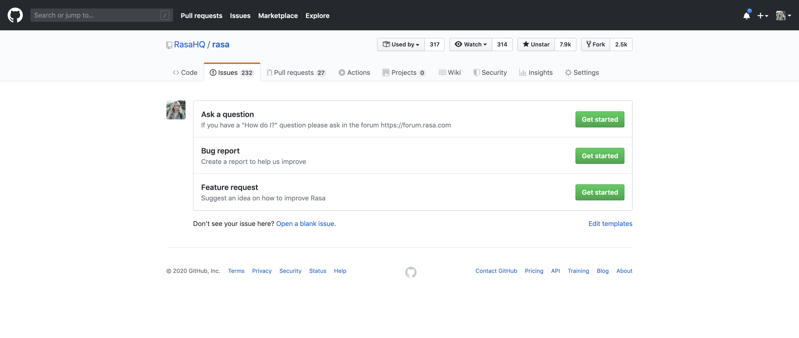

# Contributing Guidlines
### Learn how to create issues, Fork a repo, makes changes, and ask the maintainers to review and merge it
## Creating Pull Request
You have a Github repo and can push to it. All is well. But how the heck do you contribute to other people's Github projects? That is what I wanted to know after I learned git and Github. I will explain how to fork a git repo, make changes, and submit a pull request.

 - when you want to work on other's Github project, the first step is to fork a repo.
  
 
 Once there click on the Fork button in the top-right corner.
 This creates a new copy of repo under your Github user account.
 - Clone this Github repo. Open up the GitBash/Command Line and type in:
 Don't forget to write your guthub user name.
 

- cd into the specific directory. Now create a branch of the master by pushind the command: git branch < YOUR_USERNAME >
 

- You can now check the branches by pushing in the comand: git branch.
You will see the Master Branch and another branch with your username.

- Switch to Development Branch. Never develop on Master Branch. Push in the command: git checkout < YOURUSERNAME >.
 

- Start Coding. Make apt commits with proper commit messages. Always use git status to see that you have not made changes on file you were supposed not to.
- Add all the changes with this command: (git add . ). This will add the changes to your present workspace. 
 

- Make a commit. This will save a snapshot of your Project.
 

- Push the changes: git push
 

- Once you push the changes to your repo, Go to your forked repository, the Compare & pull request button will appear in GitHub.
 

- Click it and you'll be taken to this screen:
 
Open a pull request by clicking the Create pull request button. This allows the repo's maintainers to reviews your work. 
From here, they can merge it if it is good, or they may ask you for some changes.
 

## Creating issue
  Issues can be used to keep track of bugs, enhancements, or other request.

  - On GitHub, navigate to the main page of the repository.
  - Under your repository name, click on Issues button.
   

- Click New issue.
   
- If there are multiple issue types, click Get started next to the type of issue you'd like to open.
   
  - Type a title and description for your issue.
  - After creating the issue you have to wait until the project maintainer assign the issue to you.
  - when you're finished, click Submit new issue.
   

##### If Still you have some problem then Do watch this tutorial
[Git & GitHub Tutorial](https://www.youtube.com/watch?v=RGOj5yH7evk)

